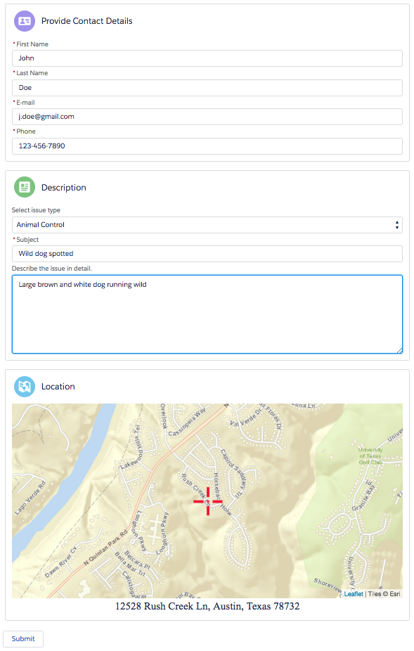

# PSCaseIntake

A single page app for submitting a case. The original intent of this component was to provide a non-authenticated mobile page to submit cases. The layout currently is not optimized for desktop. This component utilizes Lightning Out to expose a Lightning Component in a non-authenticated page and requires wrapping in a VisualForce page. 

<b>Input form includes 3 primary sections:</b>
  1. User details (first, last, email, phone)
  2. Case details (type, sub-type, subject, description)
  3. Dynamic map with reverse geocode lookup to get address location, street address, and lat/lng.
 
<b>To deploy and use this component:</b>
  1. Deploy the component to your org using "Deploy to Salesforce" button below
  2. Add the CaseIntake VisualForce page to the Force.com Site of your community
     - Community Workspace > Administration > Pages > Go to Force.com
     - Add "CaseIntake" to the Site Visualforce Pages section
  3. Access the page using URL format: <community-base-URL>/CaseIntake
     - Example for my development community: https://th-dev-developer-edition.na40.force.com/dev/CaseIntake

<b>Sample screen here:</b>

</img>

